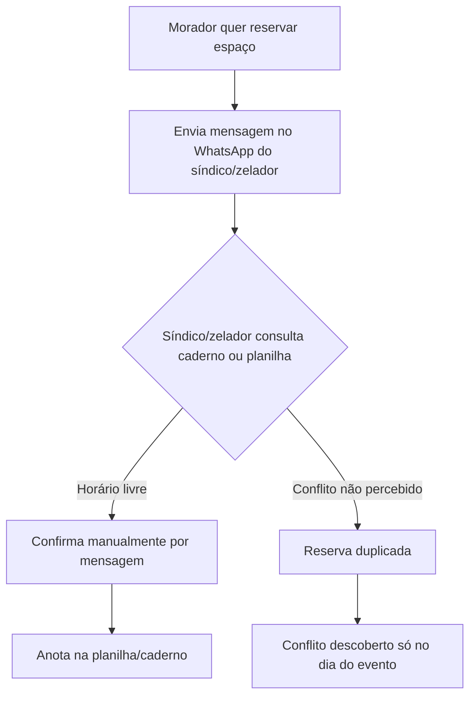
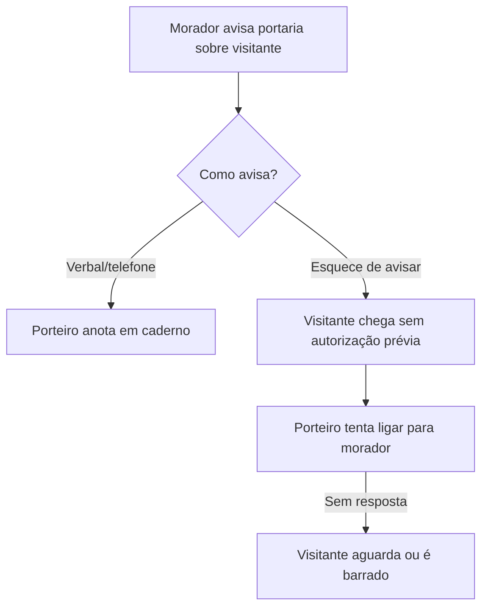
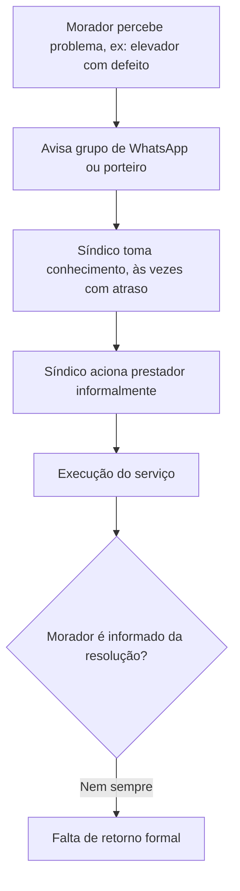
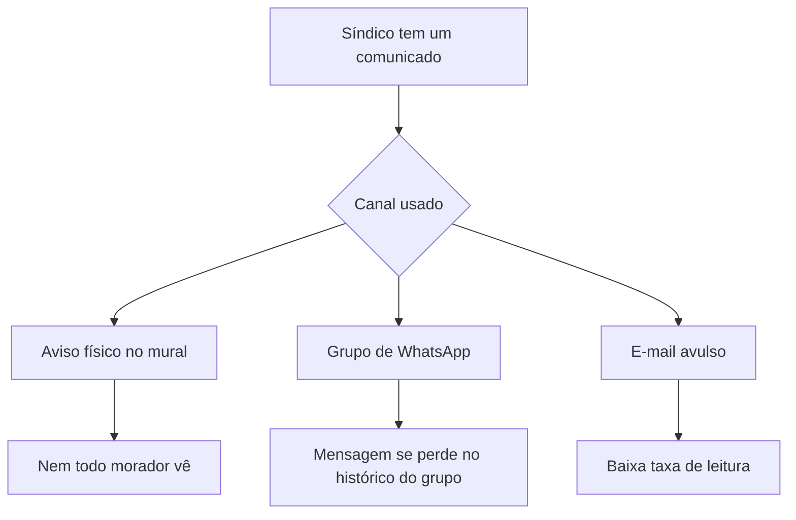

# 03 — Cenário As-Is

## 3.1 Visão Geral do Processo Atual

Atualmente, a operação do condomínio depende de canais fragmentados e não integrados: WhatsApp, planilhas, e-mail, avisos físicos no mural e controle manual em papel/caderno na portaria.

## 3.2 Fluxo Atual — Reserva de Espaço Comum

**Gargalos:** dependência de resposta manual do síndico/zelador; sem verificação automática de conflito; risco de duplicidade só descoberto na hora do uso.

## 3.3 Fluxo Atual — Controle de Visitantes

**Gargalos:** ausência de pré-autorização confiável; dependência de contato telefônico no momento da chegada; sem histórico digital de quem entrou/saiu.

## 3.4 Fluxo Atual — Ocorrências

**Gargalos:** sem status visível (aberta/em análise/resolvida); informação se perde em grupos de WhatsApp; morador não tem retorno formal.

## 3.5 Fluxo Atual — Comunicação Geral

**Gargalos:** nenhum canal garante alcance nem confirmação de leitura; comunicados importantes se perdem entre mensagens informais.

## 3.6 Problemas Existentes

| Categoria | Problema |
|---|---|
| Comunicação | Fragmentada entre WhatsApp, mural físico e e-mail; sem confirmação de leitura |
| Reservas | Conflitos de horário descobertos tardiamente |
| Visitantes | Sem pré-autorização confiável; dependência de contato telefônico |
| Ocorrências | Sem status visível; retorno ao morador inconsistente |
| Documentos | Difícil acesso (pasta física, e-mail perdido) |
| Financeiro | Prestação de contas manual, pouco transparente |
| Governança | Dependência excessiva da memória e disponibilidade do síndico |

## 3.7 Custos Operacionais Atuais 

- Tempo do síndico/zelador gasto respondendo mensagens repetitivas (reservas, dúvidas, autorizações);
- Retrabalho por conflitos de reserva e falta de registro único;
- Custo de impressão/afixação de avisos físicos;
- Tempo da portaria tentando confirmar visitantes por telefone.

## 3.8 Riscos do Modelo Atual

- **Risco operacional:** decisões e histórico dependem de uma pessoa (síndico), sem continuidade formal se ela sair ou estiver indisponível;
- **Risco de segurança:** controle de visitantes frágil, sem rastreabilidade;
- **Risco jurídico/administrativo:** falta de registro formal de decisões e prestação de contas pode gerar contestação de moradores;
- **Risco de reputação/satisfação:** comunicação falha gera insatisfação e desconfiança na gestão.