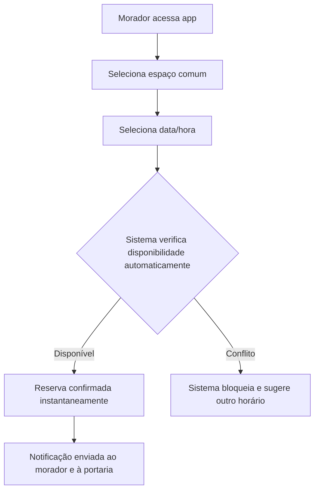
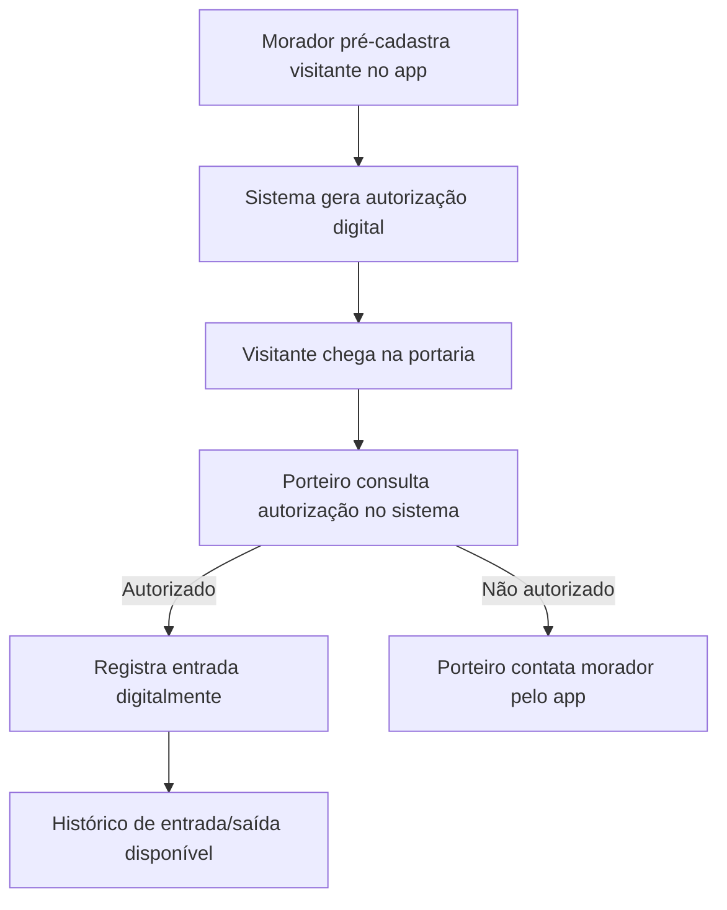
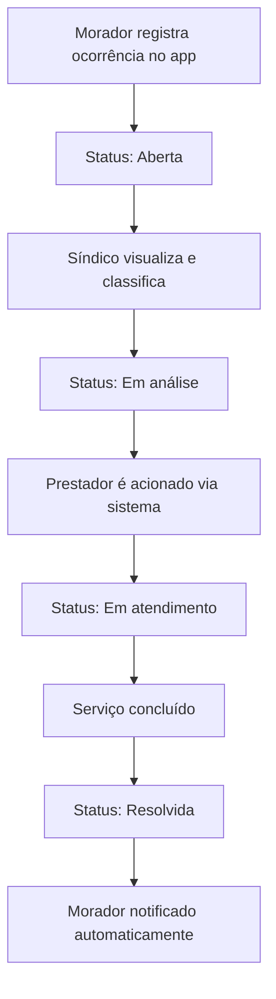
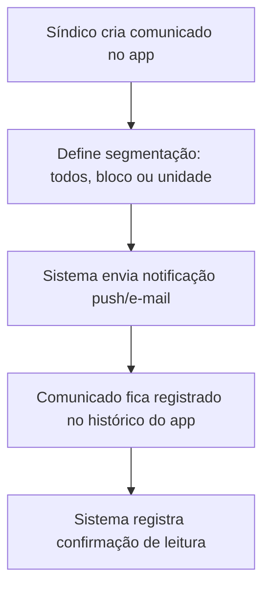

# 04 — Cenário To-Be

## 4.1 Visão Geral

Na plataforma, cada fluxo hoje disperso em canais informais passa a ser um processo digital, com regras de negócio automatizadas, status visível e histórico centralizado.

## 4.2 Fluxo To-Be — Reserva de Espaço Comum

## 4.3 Fluxo To-Be — Controle de Visitantes

## 4.4 Fluxo To-Be — Ocorrências

## 4.5 Fluxo To-Be — Comunicação Geral

## 4.6 Comparação As-Is vs. To-Be

| Processo | As-Is | To-Be |
|---|---|---|
| Reservas | Manual, via WhatsApp/caderno; conflitos descobertos tardiamente | Automático, com verificação de conflito em tempo real |
| Visitantes | Contato telefônico no momento da chegada | Pré-autorização digital + histórico de entrada/saída |
| Ocorrências | Sem status visível; retorno inconsistente | Status rastreável (Aberta → Resolvida) + notificação automática |
| Comunicação | Mural físico, WhatsApp, e-mail avulso; sem confirmação | Notificação segmentada com confirmação de leitura |
| Documentos | Pasta física ou e-mail perdido | Repositório digital com controle de acesso por perfil |
| Financeiro | Prestação de contas manual | Relatórios e status de pagamento centralizados |
| Governança | Dependente da memória do síndico | Histórico institucional, não depende de uma pessoa |

## 4.7 Ganhos Esperados

**Redução de custos operacionais**
- Menos tempo do síndico/zelador respondendo mensagens repetitivas;
- Redução de retrabalho por conflitos de reserva.

**Redução de riscos**
- Rastreabilidade de visitantes (segurança);
- Histórico formal de decisões e prestação de contas (risco jurídico/administrativo);
- Continuidade da gestão independente de uma única pessoa.

**Melhoria na experiência do usuário**
- Morador tem visibilidade em tempo real (reservas, ocorrências, comunicados);
- Portaria opera com informação confiável, sem depender de ligações.

**Melhoria operacional**
- Regras de negócio automatizadas (conflito de reserva, fluxo de ocorrência) eliminam decisões manuais repetitivas;
- Dados centralizados viabilizam os KPIs definidos na Visão de Negócio (ex: tempo médio de resolução de ocorrências).