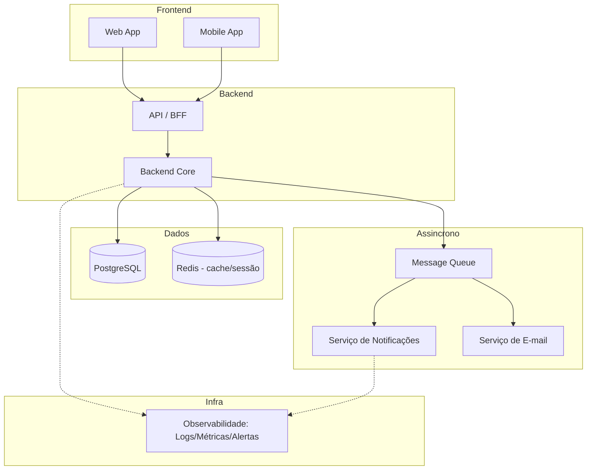

# 07 — Visão Arquitetural

## 7.1 Visão Geral

A arquitetura de alto nível organiza o sistema em quatro grandes blocos: **Frontend**, **Backend**, **Banco de Dados** e **Infraestrutura**, com um bloco assíncrono de mensageria para desacoplar operações não-críticas (notificações, e-mails).

## 7.2 Frontend

- **Web App** (síndico, administrador, conselheiro — telas de gestão mais densas em informação) e **Mobile App** (morador, portaria — uso rápido e no dia a dia: reservar, autorizar visitante, ver comunicado).
- Ambos consomem a mesma API/BFF — nenhuma regra de negócio replicada no cliente (justificado por **RNF-SEG-06**: autorização deve ser validada sempre no backend).

## 7.3 Backend

### API / BFF (Backend for Frontend)
- Camada fina responsável por autenticação, roteamento e formatação de resposta adequada a cada cliente (web/mobile), sem lógica de negócio.

### Backend Core
- Concentra as regras de negócio, organizado em **módulos por domínio**: Reservas, Visitantes, Ocorrências, Comunicação, Documentos, Financeiro, Prestadores, Gestão do Condomínio.
- **Decisão arquitetural: monólito modular** (não microsserviços).
  - **Justificativa:** RNF-MANT-01 pede modularização por domínio, não necessariamente serviços distribuídos; para o volume esperado (SaaS multi-tenant em fase inicial), microsserviços adicionariam complexidade operacional (deploy, observabilidade distribuída) sem benefício claro ainda. RNF-ESC-01/03 são atendidos porque os módulos mais sensíveis a carga (notificações) já nascem desacoplados via fila, permitindo extrair esse módulo como serviço independente no futuro sem redesenhar o core.

## 7.4 Banco de Dados

- **PostgreSQL** como banco relacional principal.
  - **Justificativa:** o domínio tem fortes relacionamentos (unidade → morador → reserva/ocorrência) e exige integridade transacional forte, especialmente para evitar reserva duplicada (**RNF-CONF-01**) — cenário onde um banco relacional com transações ACID é mais adequado que um NoSQL.
  - **Multi-tenancy** (RNF-ESC-01/02): isolamento lógico por `tenant_id` (condomínio) em todas as tabelas relevantes, com estratégia de particionamento a ser detalhada na Arquitetura de Dados.
- **Redis** para cache e gerenciamento de sessão.
  - **Justificativa:** suporta RNF-PERF-01 (respostas rápidas em consultas comuns) e pode ser usado como mecanismo de lock distribuído auxiliar na verificação de conflito de reserva (RNF-PERF-02/RNF-CONF-01).

## 7.5 Infraestrutura

- **Containers (Docker)** para empacotar o Backend Core e serviços assíncronos, viabilizando deploy consistente e escalável.
- **Message Queue** dedicada para notificações/e-mails — desacopla operações não-críticas do fluxo principal (RNF-DISP-03: falha no envio de notificação não pode indisponibilizar reserva/autorização de visitante).
- **Observabilidade** (logs estruturados, métricas, alertas) como camada transversal, atendendo RNF-OBS-01/02/03.
- Infraestrutura em nuvem (cloud) para suportar RNF-ESC-01 (crescimento horizontal) — provedor específico e detalhes de rede/servidores ficam no arquivo `arquitetura-fisica.md`.

## 7.6 Rastreabilidade com RNFs (amostra)

| Decisão arquitetural | RNF que justifica |
|---|---|
| Monólito modular por domínio | RNF-MANT-01, RNF-MANT-02 |
| PostgreSQL (relacional, transacional) | RNF-CONF-01, RNF-PERF-02 |
| Multi-tenant lógico | RNF-ESC-01, RNF-ESC-02 |
| Fila assíncrona para notificações | RNF-DISP-03, RNF-ESC-03, RNF-PERF-03 |
| Autorização sempre validada no backend | RNF-SEG-04, RNF-SEG-05, RNF-SEG-06 |
| Camada de observabilidade transversal | RNF-OBS-01, RNF-OBS-02, RNF-OBS-03 |