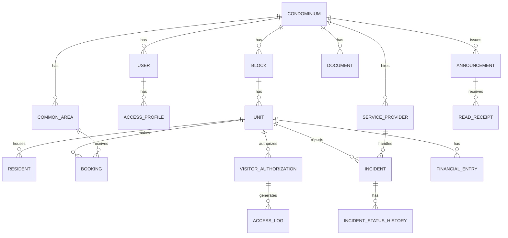

# 07 — Visão Arquitetural

## 7.1 Estratégia de Persistência

- **Banco relacional único (PostgreSQL)**, com **multi-tenancy lógico**: todas as tabelas de domínio possuem uma coluna `condominium_id` (tenant), garantindo isolamento de dados entre condomínios diferentes na mesma base.
- **Redis** não armazena dado de negócio persistente — usado apenas como cache de leitura e para lock auxiliar em operações concorrentes (ex: verificação de conflito de reserva).
- Tabelas sensíveis (financeiro, documentos sigilosos) seguem o mesmo isolamento por tenant, com controle de acesso reforçado na camada de aplicação (RNF-SEG-09).

## 7.2 Modelo de Entidades — Visão Geral

## 7.3 Entidades Principais (resumo)

### Gestão do Condomínio
- **CONDOMINIUM**: `id`, `name`, `address`, `settings` (tenant raiz de todo o modelo).
- **BLOCK**: `id`, `condominium_id`, `name`.
- **UNIT**: `id`, `block_id`, `number`, `condominium_id`.
- **USER**: `id`, `condominium_id` (nulo para usuários multi-condomínio, ex: administradora), `name`, `email`, `password_hash`.
- **ACCESS_PROFILE**: `id`, `user_id`, `role` (Resident, Manager, Administrator, Concierge, CouncilMember, ServiceProvider), `unit_id` (quando aplicável).

### Reservas
- **COMMON_AREA**: `id`, `condominium_id`, `name`, `operating_hours`, `unit_booking_limit`.
- **BOOKING**: `id`, `common_area_id`, `unit_id`, `start_datetime`, `end_datetime`, `status` (Confirmed/Cancelled).
  - Restrição de integridade: constraint de **não sobreposição de horário** por `common_area_id` (via constraint de exclusão do PostgreSQL — `EXCLUDE USING gist`), garantindo RNF-CONF-01 no nível do banco, não só na aplicação.

### Visitantes
- **VISITOR_AUTHORIZATION**: `id`, `unit_id`, `visitor_name`, `valid_from`, `valid_until`.
- **ACCESS_LOG**: `id`, `visitor_authorization_id` (opcional, para acesso não pré-autorizado), `visitor_name`, `checked_in_at`, `checked_out_at`, `registered_by` (funcionário).

### Ocorrências
- **INCIDENT**: `id`, `unit_id`, `condominium_id`, `description`, `current_status`, `service_provider_id` (opcional).
- **INCIDENT_STATUS_HISTORY**: `id`, `incident_id`, `previous_status`, `new_status`, `changed_by`, `changed_at` (atende RNF-CONF-02 — auditabilidade).

### Comunicação
- **ANNOUNCEMENT**: `id`, `condominium_id`, `title`, `content`, `target_scope` (all/block/unit), `created_by`, `created_at`.
- **READ_RECEIPT**: `id`, `announcement_id`, `user_id`, `read_at`.

### Documentos
- **DOCUMENT**: `id`, `condominium_id`, `type` (bylaws, minutes, contract, financial_statement), `file_url`, `access_level` (public/manager/council).

### Financeiro
- **FINANCIAL_ENTRY**: `id`, `unit_id`, `condominium_id`, `type` (fee/expense), `amount`, `payment_status`, `reference_period`.

### Prestadores
- **SERVICE_PROVIDER**: `id`, `condominium_id`, `name`, `service_type`, `contract_url`, `active_status`.

## 7.4 Regras de Integridade Relevantes

| Regra | Mecanismo |
|---|---|
| Sem sobreposição de horário na mesma BOOKING/espaço | Constraint de exclusão no PostgreSQL (nível banco) |
| Isolamento entre condomínios (tenants) | `condominium_id` obrigatório + Row-Level Security (RLS) do PostgreSQL |
| Histórico de status não pode ser apagado/editado retroativamente | Tabela `INCIDENT_STATUS_HISTORY` é apenas-inserção (append-only) |
| Acesso a documentos sigilosos | `access_level` validado sempre no backend, nunca só na query do cliente |

## 7.5 Rastreabilidade com RNFs

| Decisão de dados | RNF relacionado |
|---|---|
| Constraint de exclusão para reservas | RNF-CONF-01 |
| `condominium_id` + Row-Level Security | RNF-ESC-01, RNF-ESC-02, RNF-SEG-04 |
| Tabela append-only de histórico | RNF-CONF-02 |
| `access_level` em Documents/Financial | RNF-SEG-09 |