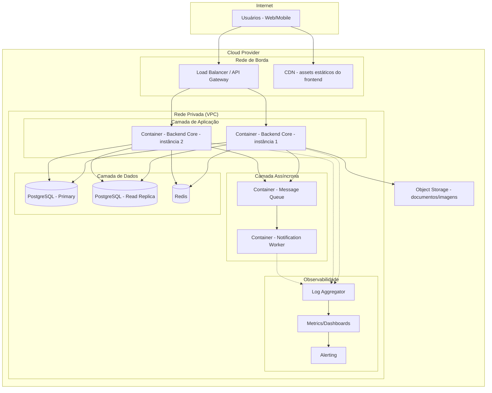

# 07 — Visão Arquitetural

## 7.1 Visão Geral

A infraestrutura física traduz a arquitetura lógica em recursos concretos de nuvem, priorizando simplicidade operacional no MVP (coerente com a decisão de monólito modular) e caminho claro de evolução para escalar (RNF-ESC-01).

## 7.2 Componentes Físicos

### Rede de Borda
- **Load Balancer / API Gateway**: ponto único de entrada, faz roteamento para as instâncias do Backend Core e TLS termination (RNF-SEG-10 — criptografia em trânsito).
- **CDN**: serve assets estáticos do Web App, reduzindo latência para o usuário final.

### Camada de Aplicação
- **Containers do Backend Core** (Docker), em **mínimo 2 instâncias** atrás do load balancer.
  - **Justificativa:** atende RNF-DISP-01 (SLA de disponibilidade) — uma instância pode falhar/atualizar sem indisponibilizar o sistema.
  - Escalonamento horizontal (adicionar mais instâncias) é a estratégia de crescimento (RNF-ESC-01), sem necessidade de redesenho, já que o Backend Core é stateless (sessão fica no Redis).

### Camada Assíncrona
- **Message Queue** (ex: RabbitMQ ou similar) roda em container próprio, isolado da aplicação.
- **Notification Worker**: container dedicado que consome a fila e dispara notificações push/e-mail.
  - **Justificativa:** isola o processamento não-crítico (RNF-DISP-03), e pode escalar/cair independentemente da aplicação principal (RNF-ESC-03).

### Camada de Dados
- **PostgreSQL Primary**: instância principal, responsável por todas as escritas.
- **PostgreSQL Read Replica**: réplica de leitura.
- **Redis**: instância gerenciada, usada para cache e lock auxiliar de concorrência em reservas.
- **Backups automatizados** do PostgreSQL, com política de retenção definida (RNF-CONF-03).

### Armazenamento de Arquivos
- **Object Storage** para documentos,atas, contratos e imagens

### Observabilidade
- **Log Aggregator + Métricas + Alertas** como camada transversal, coletando dados de todos os containers (RNF-OBS-01/02/03).

## 7.3 Ambientes

| Ambiente | Finalidade |
|---|---|
| Desenvolvimento | Uso local/individual, com Docker Compose simulando os principais serviços (Postgres, Redis, MQ) |
| Homologação/Staging | Validação de integração antes de produção, espelhando topologia de produção em menor escala |
| Produção | Ambiente com réplicas, backups e monitoramento ativo |

## 7.4 Rastreabilidade com RNFs

| Decisão física | RNF relacionado |
|---|---|
| Múltiplas instâncias do Backend Core atrás de Load Balancer | RNF-DISP-01, RNF-ESC-01 |
| Backend Core stateless (sessão no Redis) | RNF-ESC-01 |
| Worker de notificação isolado | RNF-DISP-03, RNF-ESC-03 |
| Read Replica do PostgreSQL | RNF-PERF-01 |
| Backups automatizados | RNF-CONF-03 |
| TLS termination no Load Balancer | RNF-SEG-10 |
| Log Aggregator/Métricas/Alertas | RNF-OBS-01, RNF-OBS-02, RNF-OBS-03 |