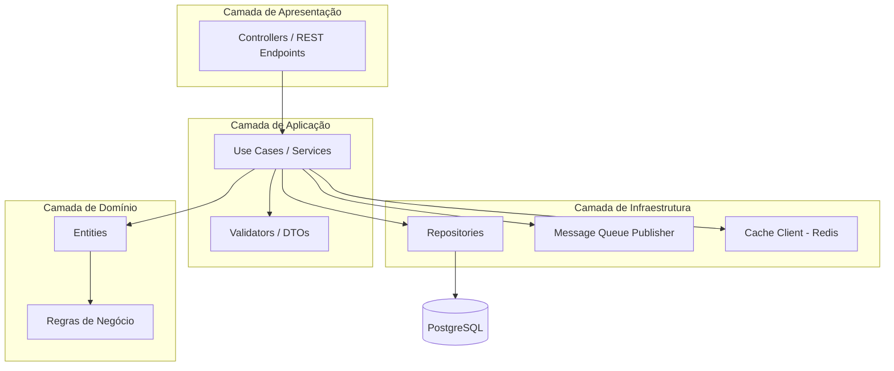
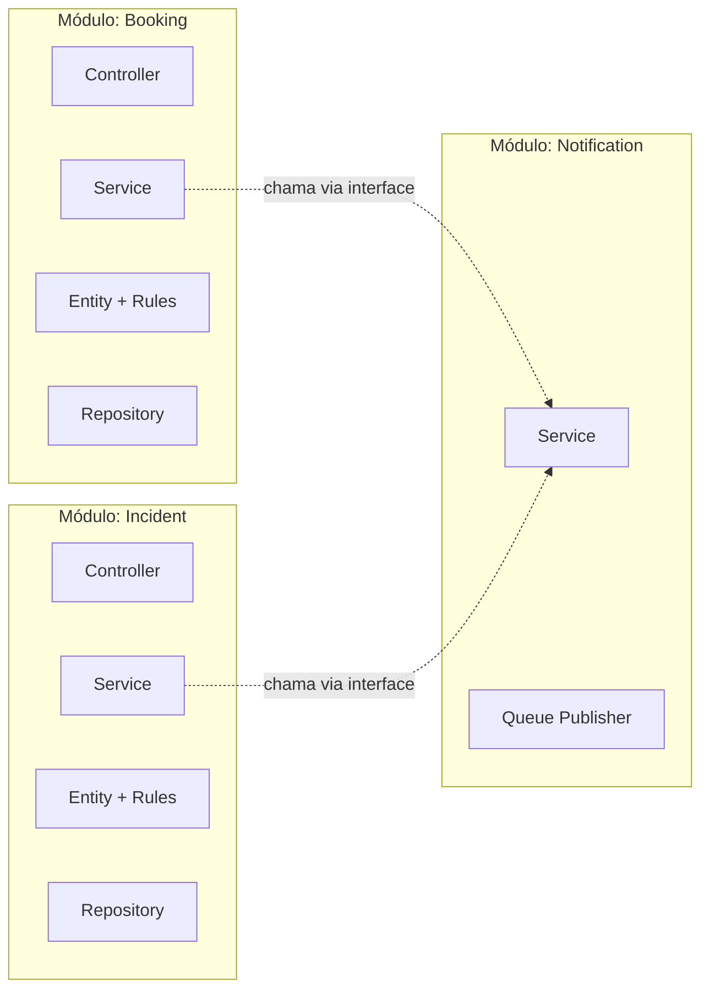
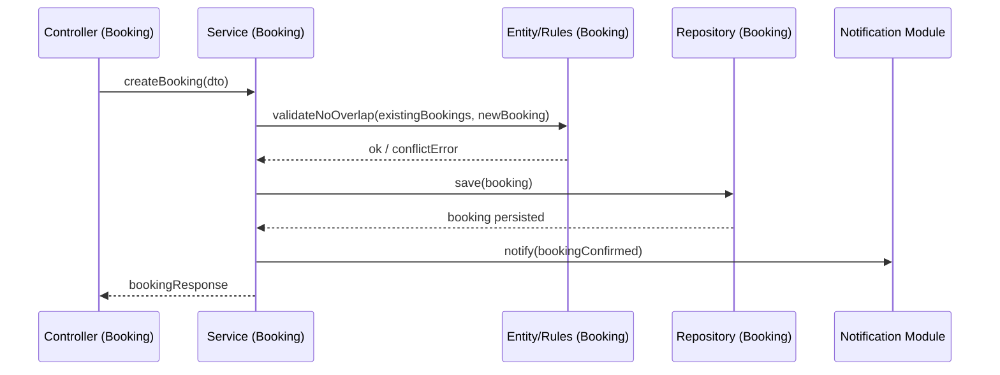

# 07 — Visão Arquitetural

## 7.1 Visão Geral

A arquitetura lógica detalha como o Backend Core é organizado internamente: em **camadas horizontais** (responsabilidades técnicas) e **módulos verticais por domínio** (Reservas, Visitantes, Ocorrências etc.), conforme decidido na `arquitetura-alto-nivel.md` (monólito modular).

## 7.2 Camadas 

| Camada | Responsabilidade | Não deve conter |
|---|---|---|
| **Presentation** | Receber requisição HTTP, autenticação/autorização (RBAC), formatar resposta | Regra de negócio |
| **Application** | Orquestrar casos de uso, validar entrada (DTOs) | Acesso direto a banco |
| **Domain** | Entidades e regras de negócio puras (ex: "reserva não pode sobrepor horário") | Dependência de framework/infra |
| **Infrastructure** | Acesso a banco, fila, cache, storage externo | Regra de negócio |

**Justificativa:** essa separação atende **RNF-MANT-02** (padrão arquitetural claro, evitando acoplamento) e **RNF-MANT-03** (regras de negócio isoladas na camada de Domínio são mais fáceis de testar de forma automatizada).

## 7.3 Módulos por Domínio (organização vertical)

Cada módulo replica as 4 camadas internamente, mas só se comunica com outro módulo através de sua camada de Application (nunca acessando o Domain ou Repository de outro módulo diretamente):

### Lista de módulos
1. **CondominiumManagement** — condomínio, blocos, unidades, usuários, perfis de acesso (RBAC).
2. **Booking** — espaços comuns, reservas, regra de não sobreposição.
3. **VisitorAccess** — autorizações de visitante, registro de entrada/saída.
4. **Incident** — ocorrências e histórico de status.
5. **Communication** — comunicados, segmentação, confirmação de leitura.
6. **Document** — documentos e controle de nível de acesso.
7. **Financial** — lançamentos financeiros, status de pagamento.
8. **ServiceProvider** — cadastro e status de prestadores.
9. **Notification** *(módulo transversal)* — consumido pelos demais módulos via interface, publica na Message Queue; não conhece regra de negócio de nenhum outro módulo.

**Justificativa:** módulos isolados por domínio permitem que **RNF-MANT-01** seja cumprido — cada módulo pode evoluir, ser testado e até ser extraído futuramente como serviço independente (ex: Notification, já apontado como candidato na `arquitetura-alto-nivel.md`) sem redesenhar o restante do sistema.

## 7.4 Componentes Transversais (cross-cutting)

| Componente | Função |
|---|---|
| **AuthGuard / RBAC Middleware** | Valida token e papel do usuário em toda requisição (RNF-SEG-04/05/06) |
| **AuditLogger** | Registra alterações sensíveis (ex: mudança de status de Incident) para auditoria (RNF-CONF-02, RNF-SEG-11) |
| **TenantResolver** | Identifica o `condominium_id` da requisição e garante que toda query seja filtrada por tenant (RNF-ESC-01/02) |
| **ObservabilityInterceptor** | Captura logs estruturados e métricas de cada requisição (RNF-OBS-01/02) |

## 7.5 Fluxo Lógico de Exemplo — Criar Reserva (US01)

## 7.6 Rastreabilidade com RNFs

| Decisão lógica | RNF relacionado |
|---|---|
| Separação em 4 camadas (Presentation/Application/Domain/Infra) | RNF-MANT-02, RNF-MANT-03 |
| Módulos isolados por domínio, comunicação via interface | RNF-MANT-01 |
| AuthGuard/RBAC Middleware transversal | RNF-SEG-04, RNF-SEG-05, RNF-SEG-06 |
| AuditLogger | RNF-CONF-02, RNF-SEG-11 |
| TenantResolver | RNF-ESC-01, RNF-ESC-02 |
| ObservabilityInterceptor | RNF-OBS-01, RNF-OBS-02 |