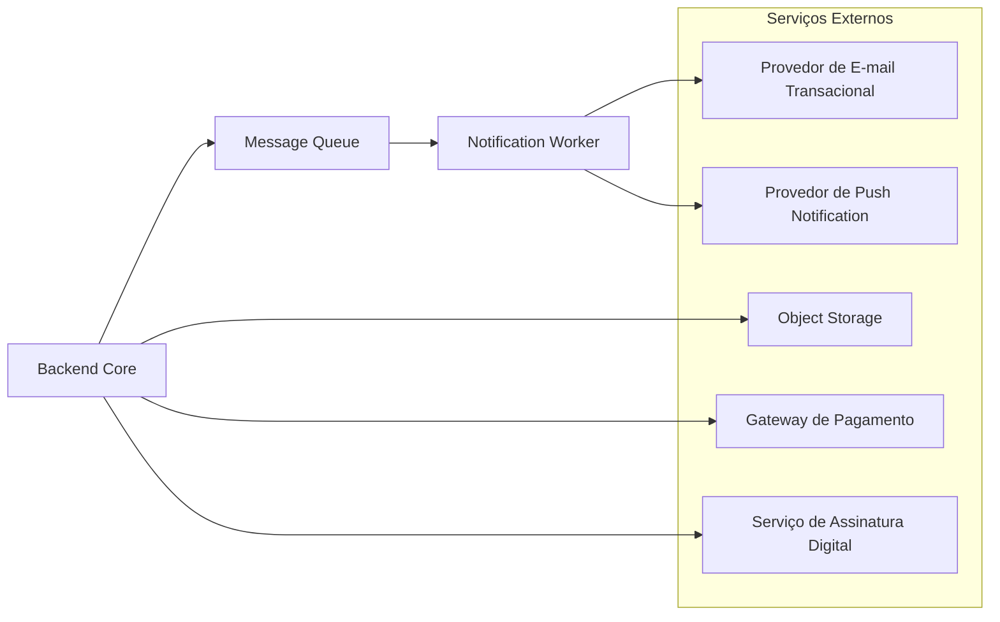

# 07 — Visão Arquitetural

## 7.1 Visão Geral

O sistema é majoritariamente autocontido (monólito modular), mas integra serviços externos especializados: envio de e-mail, notificação push, armazenamento de arquivos, pagamento e assinatura digital de documentos.

## 7.2 Provedor de E-mail Transacional
- **Uso:** confirmação de reserva, notificação de mudança de status de ocorrência, comunicados (US02, US07, US09).
- **Padrão de integração:** assíncrono, via `Notification Worker` consumindo a `Message Queue` — nunca chamado diretamente pelo fluxo síncrono do usuário (RNF-PERF-03, RNF-DISP-03).
- **Contrato:** API REST/SMTP do provedor; abstraído por uma interface interna (`EmailSender`) para permitir troca de provedor sem impactar o domínio.

## 7.3 Provedor de Push Notification
- **Uso:** notificações mobile (autorização de visitante, comunicado segmentado, atualização de ocorrência).
- **Padrão de integração:** mesmo modelo assíncrono do e-mail, via `Notification Worker`.

## 7.4 Object Storage
- **Uso:** upload/download de documentos (atas, contratos) e imagens.
- **Padrão de integração:** o Backend Core gera uma URL assinada (upload/download direto do cliente para o storage), evitando que arquivos grandes trafeguem pelo próprio backend — reduz carga na camada de aplicação (alinhado a RNF-PERF-01).
- Acesso ao arquivo respeita o `access_level` do Document (RNF-SEG-09) — a URL assinada só é gerada se o usuário tiver permissão.

## 7.5 Gateway de Pagamento
- **Uso:** pagamento da taxa condominial diretamente pela plataforma, além da consulta de status (US12).
- **Padrão de integração:** o Backend Core cria a cobrança via API do gateway e recebe confirmação por webhook, atualizando o `FINANCIAL_ENTRY` correspondente.
- **Isolamento:** essa integração fica encapsulada dentro do módulo `Financial`, sem impactar os demais módulos (RNF-MANT-01).
- Credenciais e chamadas seguem o mesmo padrão de segurança das demais integrações (RNF-SEG-10).

## 7.6 Serviço de Assinatura Digital
- **Uso:** assinatura de atas e documentos oficiais diretamente na plataforma.
- **Padrão de integração:** o Backend Core envia o documento para o provedor de assinatura via API e recebe o documento assinado/status via webhook, atualizando o `DOCUMENT` correspondente.
- **Isolamento:** encapsulado no módulo `Document`.

## 7.7 Padrões Gerais de Integração

| Padrão | Aplicação |
|---|---|
| **Integrações não-críticas são sempre assíncronas** | E-mail, push — via fila, nunca bloqueiam a resposta ao usuário (RNF-DISP-03) |
| **Abstração por interface** | Cada integração externa tem uma interface interna (`EmailSender`, `PushSender`, `FileStorage`, `PaymentGateway`, `SignatureProvider`), permitindo trocar o provedor sem alterar regra de negócio |
| **Falha de integração externa não derruba o core** | Se o provedor de e-mail cair, a reserva/ocorrência já foi confirmada — a notificação apenas fica retida na fila para reprocessamento |
| **Credenciais de integração nunca hardcoded** | Configuração via variáveis de ambiente / secrets manager (reforça RNF-SEG-10) |

## 7.8 Rastreabilidade com RNFs

| Integração | RNF relacionado |
|---|---|
| E-mail/Push assíncronos via fila | RNF-PERF-03, RNF-DISP-03, RNF-ESC-03 |
| URL assinada para Object Storage | RNF-PERF-01, RNF-SEG-09 |
| Gateway de Pagamento via webhook | RNF-MANT-01, RNF-SEG-10 |
| Serviço de Assinatura Digital via webhook | RNF-MANT-01 |
| Abstração por interface (troca de provedor) | RNF-MANT-01, RNF-MANT-02 |
| Secrets/variáveis de ambiente | RNF-SEG-10 |